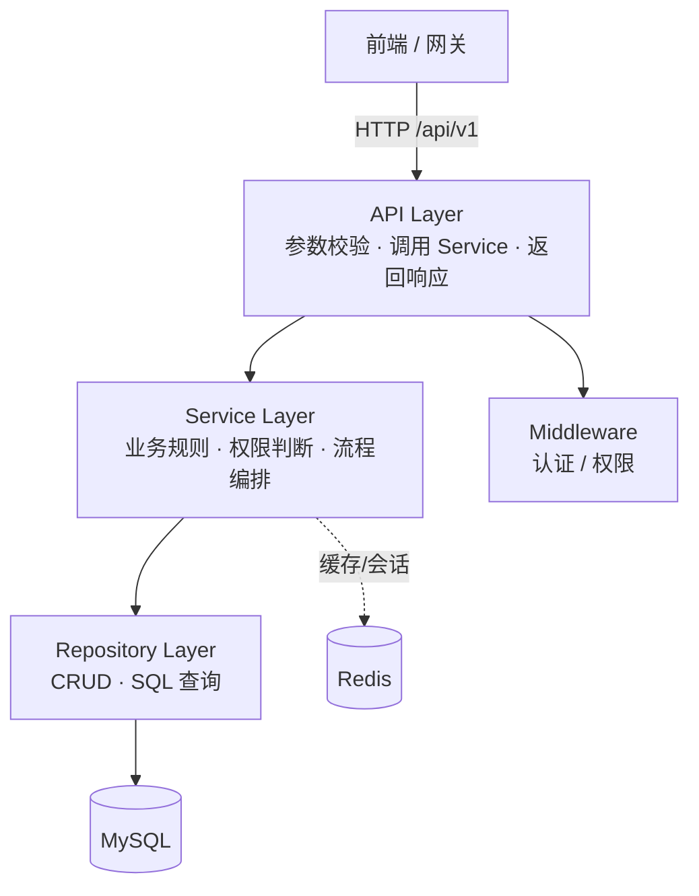
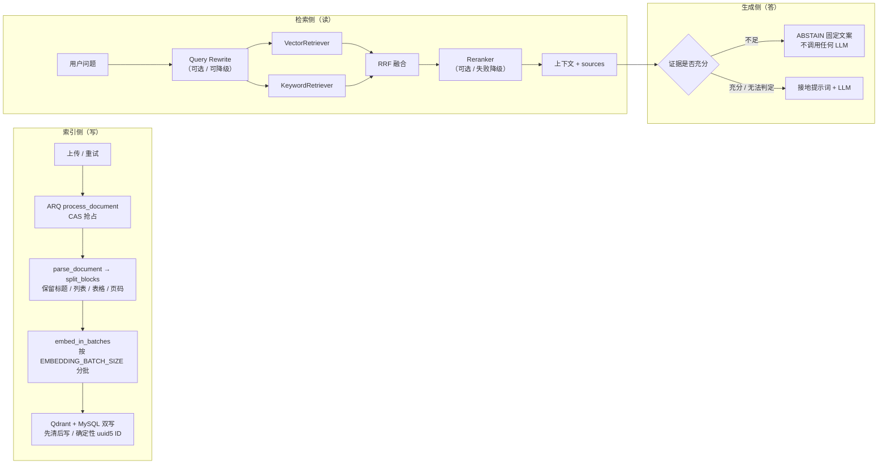

# Business Backend — 企业级 AI 平台业务控制后台

> 基于 **模块化单体（Modular Monolith）** 架构的 AI Agent 平台业务后端（含内嵌 RAG 能力）。

覆盖 **IAM / 用户 / 角色 / 权限 / 组织 / 操作日志 / Agent 与模型管理 / 知识库 / AI 对话 / 用量统计** 等业务能力，
并**内嵌完整的 RAG 能力**（文档解析 → 结构感知切分 → 向量化 → Hybrid 检索 → 精排 → 证据接地与拒答）。
AI 能力以 `app/modules/ai/` 模块内聚在本服务中，**不依赖外部 AI 服务**（LangChain / Qdrant / ARQ 均为进程内依赖）。

| 规模 | 数值 |
|---|---|
| 接口 | 79 个，统一前缀 `/api/v1` |
| 数据表 | 18 张（16 个 Alembic 迁移版本） |
| 测试 | 304 个用例（其中 10 个为需真实 MySQL + Qdrant + embedding 的 RAG 评测，环境不可达时 skip） |

> 延伸阅读：RAG 设计决策与踩坑见 [`MDDoc/技术要点/RAG检索增强技术要点.md`](MDDoc/技术要点/RAG检索增强技术要点.md)；
> 接口级文档见 `MDDoc/`；RAG 评测见 [`tests/rag/README.md`](tests/rag/README.md)；运维脚本见 [`scripts/README.md`](scripts/README.md)。

## 技术栈

| 类别 | 选型 |
|---|---|
| 语言 / 运行时 | Python 3.12+ |
| Web 框架 | FastAPI |
| ORM | SQLAlchemy 2.x（**异步模式**） |
| 数据库 | MySQL 8.x（驱动 `aiomysql`） |
| 迁移 | Alembic（async env，16 个版本） |
| 缓存 / 队列 Broker | Redis（`redis.asyncio`） |
| 后台任务 | **ARQ**（纯 asyncio 任务队列，`app/tasks/worker.py`） |
| 向量数据库 | **Qdrant**（RAG 检索，`qdrant-client`） |
| LLM / Agent 编排 | **LangChain**（`langchain` + `langchain-openai`，`create_agent` + 工具调用） |
| 文档解析 | `pypdf`（PDF）+ `python-docx`（DOCX）+ 正则（Markdown / TXT） |
| 文本切分 | `langchain-text-splitters`（仅超长块回退字符切分） |
| 数据校验 | Pydantic v2 + pydantic-settings |
| 认证 / 安全 | PyJWT（access + refresh）+ bcrypt（密码哈希）+ cryptography（登录密码 RSA 解密） |
| 日志 | loguru（应用）+ Loki / Promtail / Grafana（容器日志栈） |
| 依赖管理 | uv |
| 部署 | Docker / docker-compose |
| 测试 / 质量 | pytest + pytest-asyncio、ruff、mypy |

## 目录结构

```
business-backend/
├── app/
│   ├── main.py                  # 应用入口：工厂、lifespan、CORS、访问日志、异常处理、路由挂载、存活探针
│   ├── models/__init__.py       # ORM 模型聚合入口（18 张表，供 Alembic 识别差异）
│   ├── core/                    # 全局基础设施
│   │   ├── config.py            # 环境配置（pydantic-settings，含全部 RAG 开关）
│   │   ├── database.py          # 异步引擎 / 会话 / get_db 依赖 / Base
│   │   ├── redis.py             # Redis 客户端 / get_redis 依赖
│   │   ├── security.py          # JWT、bcrypt 哈希、登录密码 RSA 解密
│   │   ├── exceptions.py        # 业务异常体系 + 全局异常处理
│   │   ├── logging.py           # loguru 日志初始化
│   │   └── seed.py              # 幂等初始化（权限树 / 内置角色 / 超管账号）
│   ├── modules/                 # 业务模块（模块化单体核心，详见「功能模块」）
│   │   ├── iam/                 # 登录 / 刷新 / 登出 / 当前用户 / 公钥
│   │   ├── system/              # user / role / permission / organization / operation_log（config 仍为骨架）
│   │   ├── file/                # 通用文件上传 / 下载 / 预览（本地存储，预留 S3/MinIO）
│   │   ├── knowledge/           # 知识库 / 文档 / 切块，含解析切分 parser.py
│   │   ├── agent/               # management（Agent 与版本）/ model（供应商与实例）
│   │   ├── ai/                  # 对话 chat / 会话 conversation / 检索与接地（详见「AI 与 RAG 能力」）
│   │   └── usage/               # 用量统计（个人端 + 管理端）
│   ├── middleware/              # authentication（JWT 鉴权）/ permission（权限码）/ access_log
│   │                            #   ⚠️ AuthenticationMiddleware、PermissionMiddleware 为骨架未启用
│   ├── common/                  # 统一响应、分页、枚举、仓库基类、camelCase 入出参基类
│   ├── tasks/                   # ARQ 后台任务（worker.py + README）
│   └── utils/                   # 通用工具
├── migrations/                  # Alembic 迁移脚本（async env）
├── scripts/                     # RAG 运维脚本（索引对账 / 重索引 / 改写 A-B / 评测 CLI）
├── tests/                       # pytest 测试（含 tests/rag/ 评测框架）
├── evals/                       # RAG 评测产物（baselines 基线入库 / runs 运行输出不入库）
├── docker/                      # Dockerfile / entrypoint.sh / promtail 配置 / Grafana provisioning
├── keys/                        # 登录密码 RSA 密钥对（不入库，需自行生成）
├── storage/                     # 本地文件存储（不入库；容器内为命名卷）
├── alembic.ini
├── docker-compose.yml           # app + worker + qdrant + loki/promtail/grafana（MySQL/Redis 复用宿主机）
├── pyproject.toml               # uv 依赖与工具配置
├── .env.example
└── README.md
```

## 架构设计

### 模块化单体（Modular Monolith）

以**业务能力**（而非技术分层）为边界划分模块。每个模块内部自包含四层：



**分层职责约束**

| 层 | 职责 | 禁止 |
|---|---|---|
| API | HTTP 处理、参数校验、调 Service、返回响应 | 禁止写数据库操作、禁止复杂业务逻辑 |
| Service | 业务规则、权限判断、流程编排 | 禁止直接拼接 SQL |
| Repository | 数据库 CRUD、SQL 查询 | 禁止业务规则 |
| Model / Schema | ORM 模型 / Pydantic DTO | — |

### 依赖注入（DI）

统一通过 FastAPI 依赖注入管理共享资源，请求级生命周期：

| 依赖 | 位置 | 说明 |
|---|---|---|
| `get_db` | `app/core/database.py` | `AsyncSession`（请求结束自动关闭 / 回滚） |
| `get_redis` | `app/core/redis.py` | `Redis` 客户端（refresh 会话、令牌黑名单、令牌版本号） |
| `get_current_user` | `app/middleware/authentication.py` | 解析 Bearer access token，校验 Redis 黑名单与令牌版本号，失败抛 `UnauthorizedError`（401 / 1401） |
| `CurrentUserDep` | 同上 | 业务接口取当前用户的类型别名 |
| `require_permissions(*codes)` | `app/middleware/permission.py` | 权限码校验：superuser 放行，否则按角色权限（含父链继承）求交集，为空抛 `PermissionDeniedError`（403 / 1403） |

⚠️ **router 级鉴权必须用函数式 `Depends(get_current_user)`**，不要把 `Annotated` 别名传给 `Depends` ——
后者会破坏 multipart 表单解析（文件上传接口踩过，报 `Field required` 422）。

### 模块注册

新增业务模块三步：
1. 在 `app/modules/` 下新建模块目录（含 `api / service / repository / model / schema` 分层）
2. 在 `api.py` 中定义 `APIRouter`
3. 在 `app/modules/__init__.py` 的 `MODULES` 列表加入该 router，自动挂载到 `/api/v1` 前缀

补充约定：

- 受保护模块在 `APIRouter(..., dependencies=[Depends(get_current_user)])` 统一加登录鉴权，
  需要细粒度权限的接口再加 `dependencies=[Depends(require_permissions(PermissionCode.XXX))]`；
- 权限码常量统一放各模块的 `codes.py`（需在 `sys_permission` 表维护数据并分配给角色才生效）；
- 新增 ORM 模型后在 **`app/models/__init__.py`** 追加导入（供 Alembic 识别差异），并创建迁移；
- 静态路径（如 `/tree`、`/list`）必须注册在 `/{uuid}` 之前，否则会被 UUID 参数吞掉报 422。

## 功能模块

| 模块 | 路由前缀 | 主要能力 | 鉴权 |
|---|---|---|---|
| `iam` | `/api/v1/iam` | 登录、刷新令牌、登出、当前用户、RSA 公钥 | `login` / `refresh` / `logout` / `public-key` 公开，`me` 需登录 |
| `system` | `/api/v1/system` | 用户 / 角色 / 权限（含权限树）/ 组织（含树）/ 操作日志；`health`、`ready` 探针 | 探针公开；管理子模块需登录 + 权限码 |
| `file` | `/api/v1/file` | 上传 / 下载 / 预览（本地磁盘，预留 S3/MinIO） | 仅登录 |
| `knowledge` | `/api/v1/knowledge` | 知识库 CRUD、文档上传 / 列表 / 删除 / 重试、切块浏览与关键词搜索 | 登录 + 权限码 |
| `agent` | `/api/v1/agent/management`、`/api/v1/agent/model` | Agent 与版本（发布 / 切换 / 运行）、模型供应商与模型实例 | 登录 + 权限码 |
| `ai` | `/api/v1/ai/chat`、`/api/v1/ai/conversations` | **SSE 流式对话**、会话与消息管理 | 登录 |
| `usage` | `/api/v1/usage` | 用量记录 / 汇总 / 趋势（管理端）、个人概览与明细 | 登录；管理端需权限码 |

数据表（共 18 张）：`sys_user` `sys_role` `sys_permission` `sys_user_role` `sys_role_permission`
`sys_organization` `sys_operation_log` `sys_file` `sys_agent` `sys_agent_version` `sys_model_provider`
`sys_model_instance` `sys_knowledge_base` `sys_knowledge_document` `sys_knowledge_chunk`
`ai_conversation` `ai_message` `ai_usage_record`。

## AI 与 RAG 能力

索引侧（写）与检索生成侧（读）已全部实现，且**每个增强环节都可关闭或降级**：



开关与默认值（`app/core/config.py`）：

| 开关 | 默认 | 关闭 / 降级时的行为 |
|---|---|---|
| `RAG_HYBRID_ENABLED` | `true` | 退回纯向量检索 |
| `RAG_RERANK_ENABLED` | `false` | 走 `NoopReranker`，零外部调用，融合结果直接截断到 `RAG_TOP_K` |
| `RAG_QUERY_REWRITE_ENABLED` | `false` | 零 LLM 调用，行为与改造前逐字节一致 |
| `RAG_GROUNDING_ENABLED` | `true` | 不注入接地规则、不产出 `grounding` 出参 |
| `RAG_ABSTAIN_ENABLED` | `true` | 退化为「强约束提示词 + 无证据说明」，由模型自行拒答 |

⚠️ 两个容易误判的点：

1. **默认配置下 ABSTAIN 只由「检索 0 命中」触发** —— 未启用 Reranker 时命中没有 `rerank_score`，
   证据判定 fail-open；要完整生效需同时开 `RAG_RERANK_ENABLED`；
2. **改完 `.env` 必须重启进程** —— `get_settings()` 带 `lru_cache`，热加载不会生效。

前端契约：四个能力**都不需要前端改代码**。`sources[].score` 恒为向量余弦（精排分 `rerank_score` 不写入 `sources`）；
拒答时 `finish_reason="abstain"` 且**仍推 `delta`**、usage 记 0。完整对照表与人工验收步骤见技术要点文档 §3.6。

## 后台任务（ARQ）

| 任务 | 触发方式 | 说明 |
|---|---|---|
| `process_document` | 文档上传 / 重试接口入队 | 解析 → 结构感知切分 → 向量化 → Qdrant/MySQL 双写 |
| `run_agent_chat` | Agent 后台运行接口入队 | 后台执行 Agent 对话 |

- 入口：`app/tasks/worker.py` 的 `WorkerSettings`（`max_jobs=10`、`job_timeout=300`）
- 启动：`uv run arq app.tasks.worker.WorkerSettings`
- 文档索引采用**三阶段生命周期**：抢占 → 只读计算 → 替换；阶段 2 失败时旧索引完好，重试即可
- ⚠️ **入队一律不传 `job_id`**：ARQ 的 `result_key` TTL 默认 1 小时，传固定 ID 会让「失败后立即重试」的入队被静默丢弃；
  并发保护改由任务内的 **CAS 抢占**（`DocumentRepository.mark_parsing()`）承担，抢不到直接跳过

## 快速开始

### 前置要求

- Python 3.12+（或由 uv 自动管理）
- [uv](https://docs.astral.sh/uv/)（`curl -LsSf https://astral.sh/uv/install.sh | sh`）
- **MySQL 8 + Redis 7**：`docker-compose.yml` **已不包含这两个服务**，复用宿主机已安装实例
- **Qdrant**（RAG 必需）：可用 `docker compose up -d qdrant` 单起，或自备实例
- Docker / docker-compose（部署、Qdrant、日志栈）

### 1. 安装依赖

```bash
cd business-backend
uv sync
```

### 2. 配置环境变量

```bash
cp .env.example .env
# 至少按需修改：DB_PASSWORD、REDIS_PASSWORD、JWT_SECRET_KEY、APP_ADMIN_PASSWORD
# RAG 开关默认：hybrid 开 / rerank 关 / rewrite 关 / grounding 开（见「配置项」）
```

⚠️ `.env` 中**空值键的行尾注释会被 python-dotenv 当成值**（如 `AI_DEFAULT_MODEL=   # 注释`）。
空值键的注释必须写在**独立一行**；非空值键的行尾注释正常。

### 3. 生成登录密码 RSA 密钥对

登录接口的 `password` 需用 RSA 公钥加密后传输（公钥由 `GET /api/v1/iam/auth/public-key` 下发）：

```bash
mkdir -p keys
openssl genrsa -out keys/private.pem 2048
openssl rsa -in keys/private.pem -pubout -out keys/public.pem
```

`keys/` 已 gitignore；生产环境请在服务器生成后挂载进容器（compose 已配只读挂载）。

### 4. 初始化数据库

```bash
uv run alembic upgrade head     # 建表（16 个迁移版本）
uv run python -m app.core.seed  # 幂等：内置权限树 + 超管角色 + admin 账号
```

默认超管账号 `admin`，初始密码取 `APP_ADMIN_PASSWORD`（默认 `Admin@123456`，**生产务必修改**）。

### 5. 启动应用与 Worker

```bash
# 终端 1：API 服务
uv run uvicorn app.main:app --reload

# 终端 2：ARQ Worker（文档向量化必需；不启动则文档一直停在 pending）
uv run arq app.tasks.worker.WorkerSettings
```

访问：
- API 文档：<http://127.0.0.1:8000/docs>（`APP_ENV=production` 时关闭）
- 存活探针：`GET /health`
- 健康检查：`GET /api/v1/system/health`
- 就绪检查：`GET /api/v1/system/ready`（探测 MySQL / Redis 连通性，任一不可用返回 `degraded`）

### 6. 一键启动（容器编排）

```bash
docker compose up -d --build      # app + worker + qdrant + loki/promtail/grafana
```

容器内会先执行 `alembic upgrade head` + `seed`，再启动服务（见 `docker/entrypoint.sh`）；
MySQL / Redis 仍通过 `host.docker.internal` 连宿主机。

> 完整打包 / 发版流程（含 Apple Silicon 必须 `--platform linux/amd64`）见
> [`MDDoc/项目部署发布流程记录.md`](MDDoc/项目部署发布流程记录.md)。

## 常用命令

```bash
# ---- 依赖 ----
uv sync                                            # 安装 / 同步依赖

# ---- 数据库迁移与初始化 ----
uv run alembic revision --autogenerate -m "描述"       # 生成迁移（新模型需先在 app/models/__init__.py 注册）
uv run alembic upgrade head                          # 执行迁移
uv run alembic downgrade -1                          # 回滚一步
uv run python -m app.core.seed                       # 幂等初始化基础数据

# ---- 运行 ----
uv run uvicorn app.main:app --reload                 # API 服务
uv run arq app.tasks.worker.WorkerSettings           # ARQ Worker

# ---- 测试与代码质量 ----
uv run pytest -q                                     # 全部测试
uv run pytest tests/rag/ -q                          # RAG 检索层门禁（需真实环境，免 token，约 20s）
uv run ruff check .
uv run ruff format .

# ---- RAG 运维脚本（必须在项目根目录执行）----
uv run python scripts/rag_index_audit.py               # MySQL ↔ Qdrant 索引对账（只读，退出码 1 = 不一致）
uv run python scripts/rag_reindex.py --missing-vectors # 重索引（默认 dry-run，加 --yes 才执行）
uv run python scripts/rag_eval.py --baseline latest    # 评测报告 + 与基线对比
RAG_EVAL_ANSWERS=1 uv run pytest tests/rag/ -q         # 答案层评测（真实调模型，花 token）
```

> 已知无害噪音：`aiomysql` 退出阶段的 `Event loop is closed`、Qdrant 未启 TLS 时的
> `Api key is used with an insecure connection`、远程 Qdrant 偶发 `ConnectTimeout`（重跑即可）。

## 已实现 / 规划

| 能力 | 状态 | 位置 |
|---|---|---|
| 认证与 RBAC | ✅ 已实现（JWT + Redis 黑名单 + 令牌版本号 + 权限码） | `app/modules/iam/`、`app/modules/system/{user,role,permission}` |
| 组织 / 操作日志 | ✅ 已实现（树形组织、操作审计） | `app/modules/system/` |
| 文件上传 | ✅ 已实现（本地存储，已留 S3/MinIO 抽象） | `app/modules/file/` |
| Agent 与模型管理 | ✅ 已实现（版本发布 / 切换 / 运行、供应商与实例） | `app/modules/agent/` |
| AI 对话（SSE 流式） | ✅ 已实现（推理过程 / 步骤 / 来源 / 用量） | `app/modules/ai/chat/` |
| RAG 索引与检索 | ✅ 已实现（结构感知切分 + Hybrid + Reranker + Query Rewrite + Grounding） | `app/modules/{knowledge,ai}/` |
| 后台任务队列 | ✅ 已实现（ARQ） | `app/tasks/` |
| RAG 评测框架 | ✅ 已实现（40 题 Golden Dataset + 基线门禁） | `tests/rag/`、`scripts/rag_eval.py` |
| 用量统计 | ✅ 已实现（个人端 + 管理端） | `app/modules/usage/` |
| 系统配置管理 | 🚧 骨架（`model.py` 仅 TODO，无 API） | `app/modules/system/config/` |
| 工作流编排 | ⏳ 未实现（当前用 LangChain `create_agent` + 工具调用完成编排） | — |

## 配置项

配置均由 `app/core/config.py`（pydantic-settings）定义，支持环境变量与 `.env` 覆盖，模板见 `.env.example`。

| 分组 | 关键配置 | 说明 |
|---|---|---|
| 应用 | `APP_ENV` / `APP_DEBUG` / `APP_API_PREFIX` / `CORS_ORIGINS` | `APP_ENV=production` 时关闭 `/docs` |
| 数据库 | `DB_HOST` / `DB_PORT` / `DB_USER` / `DB_PASSWORD` / `DB_NAME` / `DB_POOL_*` | MySQL 8（aiomysql） |
| Redis | `REDIS_HOST` / `REDIS_PORT` / `REDIS_DB` / `REDIS_PASSWORD` | 会话、黑名单、ARQ 队列 |
| JWT / 安全 | `JWT_SECRET_KEY` / `JWT_ALGORITHM` / `JWT_ACCESS_TOKEN_EXPIRE_MINUTES` / `JWT_REFRESH_TOKEN_EXPIRE_DAYS` | 生产务必更换 `JWT_SECRET_KEY` |
| 登录加密 | `RSA_PRIVATE_KEY_PATH` / `RSA_PUBLIC_KEY_PATH` | 默认 `keys/*.pem` |
| 文件存储 | `FILE_STORAGE_DIR` / `FILE_MAX_SIZE` / `FILE_ALLOWED_EXTENSIONS` / `FILE_PUBLIC_BASE_URL` | 默认本地 `storage/` |
| AI 对话 | `AI_DEFAULT_MODEL` / `AI_REQUEST_TIMEOUT` / `AI_MAX_RETRIES` / `AI_MAX_HISTORY_ROUNDS` / `AI_STREAM_USAGE` | 模型实例由 `sys_model_provider` / `sys_model_instance` 管理 |
| 联网搜索 | `WEB_SEARCH_API_KEY` / `WEB_SEARCH_MAX_RESULTS` | 可选工具 `web_search` |
| 向量库 | `QDRANT_HOST` / `QDRANT_PORT` / `QDRANT_API_KEY` / `QDRANT_COLLECTION` | RAG 检索必需 |
| 文档切分 | `CHUNK_SIZE` / `CHUNK_OVERLAP` / `EMBEDDING_BATCH_SIZE` / `INDEX_STALE_MINUTES` | 改动后需重索引文档（`scripts/rag_reindex.py`） |
| RAG 检索 | `RAG_TOP_K` / `RAG_SCORE_THRESHOLD` / `RAG_HYBRID_ENABLED` / `RAG_KEYWORD_*` / `RAG_VECTOR_FETCH_K` / `RAG_RRF_K` / `RAG_*_WEIGHT` | Hybrid 召回与 RRF 融合 |
| RAG 精排 | `RAG_RERANK_ENABLED` / `RERANK_PROVIDER_CODE` / `RERANK_MODEL_CODE` / `RAG_RERANK_TIMEOUT` | 走 OpenAI 兼容 `POST {base_url}/reranks` |
| RAG 查询改写 | `RAG_QUERY_REWRITE_ENABLED` / `_HISTORY_ROUNDS` / `_TIMEOUT` / `_MAX_TOKENS` / `_MAX_CHARS` | 用推理模型时 `_MAX_TOKENS` 必须设 `1024` |
| RAG 接地与拒答 | `RAG_GROUNDING_ENABLED` / `RAG_ABSTAIN_ENABLED` / `RAG_ABSTAIN_MIN_SCORE` / `RAG_ABSTAIN_MESSAGE` | 阈值只对最高 `rerank` 分生效 |
| 用量统计 | `USAGE_TIMEZONE` | 仅用量模块读取，与容器 `TZ` 无关 |
| 日志 | `LOG_LEVEL` | 应用日志级别（容器日志由 promtail 采集入 Loki） |

> ⚠️ 改配置后必须**重启进程**（`get_settings()` 使用 `lru_cache`）。
> 每个 RAG 开关的取舍依据与实测数据见 [`MDDoc/技术要点/RAG检索增强技术要点.md`](MDDoc/技术要点/RAG检索增强技术要点.md)。

