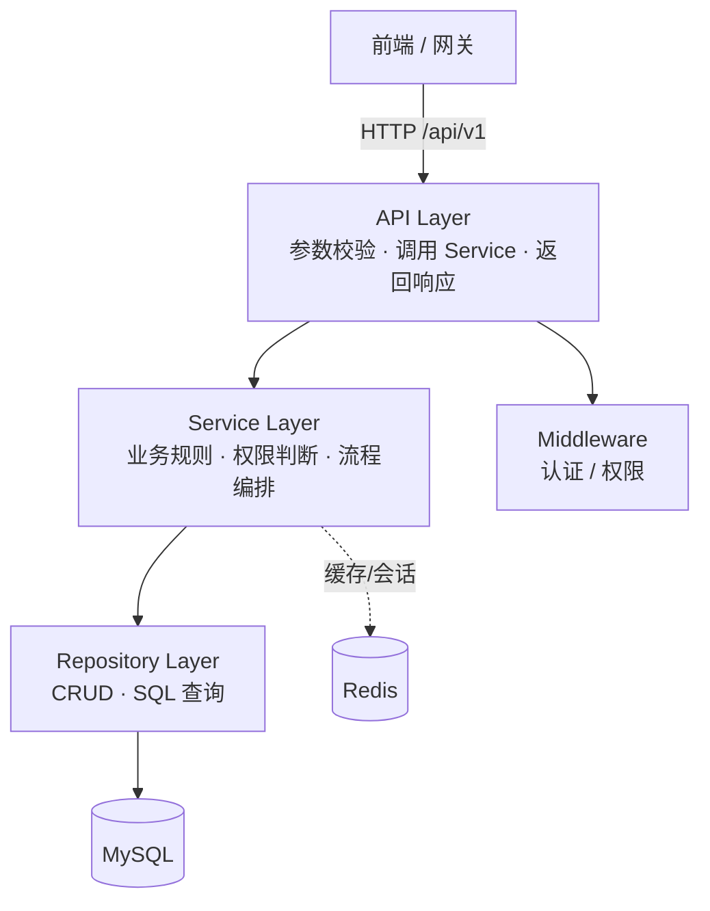

# Business Backend — 企业级 AI 平台业务控制后台

> 基于 **模块化单体（Modular Monolith）** 架构的 AI Agent 平台业务后台基础工程。

负责用户、权限、组织、Agent 配置、知识库管理、模型管理等业务能力。
**当前阶段仅搭建工程骨架与基础架构，未实现具体业务功能**；AI 能力（LangChain / LangGraph / RAG / 向量库）未来以独立模块或独立服务存在，本服务不直接依赖任何 AI 框架。

## 技术栈

| 类别 | 选型 |
|---|---|
| 语言 / 运行时 | Python 3.12+ |
| Web 框架 | FastAPI |
| ORM | SQLAlchemy 2.x（**异步模式**） |
| 数据库 | MySQL 8.x（驱动 `aiomysql`） |
| 迁移 | Alembic |
| 缓存 | Redis（`redis.asyncio`） |
| 数据校验 | Pydantic v2 + pydantic-settings |
| 依赖管理 | uv |
| 部署 | Docker / docker-compose |

## 目录结构

```
business-backend/
├── app/
│   ├── main.py                  # 应用入口：工厂、lifespan、CORS、路由挂载、健康探针
│   ├── core/                    # 全局基础设施
│   │   ├── config.py            # 环境配置（pydantic-settings）
│   │   ├── database.py          # 异步引擎 / 会话 / get_db 依赖
│   │   ├── redis.py             # Redis 客户端 / get_redis 依赖
│   │   ├── security.py          # JWT、密码哈希等安全原语
│   │   └── exceptions.py        # 业务异常体系 + 全局异常处理
│   ├── modules/                 # 业务模块（模块化单体核心）
│   │   ├── iam/                 # 身份与访问管理（骨架）
│   │   ├── organization/        # 组织管理（骨架）
│   │   ├── agent/               # Agent 配置管理（骨架）
│   │   ├── knowledge/           # 知识库管理（骨架）
│   │   ├── model/               # 模型管理（骨架）
│   │   └── system/              # 系统能力：健康 / 就绪探活（示例实现）
│   ├── middleware/              # 认证 / 权限中间件（骨架，待启用）
│   ├── common/                  # 统一响应、分页、枚举、仓库基类
│   ├── utils/                   # 通用工具
│   └── tasks/                   # 后台任务（预留）
├── migrations/                  # Alembic 迁移脚本（async env）
├── tests/                       # pytest 测试
├── docker/                      # Dockerfile / entrypoint
├── alembic.ini
├── docker-compose.yml           # MySQL8 + Redis7 + 应用
├── pyproject.toml               # uv 依赖与工具配置
├── .env.example
└── README.md
```

## 架构设计

### 模块化单体（Modular Monolith）

以**业务能力**（而非技术分层）为边界划分模块。每个模块内部自包含四层：



**分层职责约束**

| 层 | 职责 | 禁止 |
|---|---|---|
| API | HTTP 处理、参数校验、调 Service、返回响应 | 禁止写数据库操作、禁止复杂业务逻辑 |
| Service | 业务规则、权限判断、流程编排 | 禁止直接拼接 SQL |
| Repository | 数据库 CRUD、SQL 查询 | 禁止业务规则 |
| Model / Schema | ORM 模型 / Pydantic DTO | — |

### 依赖注入（DI）

统一通过 FastAPI 依赖注入管理共享资源，请求级生命周期：

- `get_db` → `AsyncSession`（请求结束自动关闭 / 回滚）
- `get_redis` → `Redis` 客户端
- `get_current_user` → 当前用户上下文（占位，待认证业务实现）

### 统一响应

所有接口（含异常）统一返回 `ApiResponse` 结构：

```json
{ "code": 0, "message": "success", "data": { } }
```

- `code == 0`：成功
- 非 0：业务错误（`1401` 未认证 / `1403` 无权限 / `1404` 不存在 / `1422` 参数校验失败 / `1000` 通用业务错误）

### 模块注册

新增业务模块三步：
1. 在 `app/modules/` 下新建模块目录（含 `api / service / repository / model / schema` 分层）
2. 在 `api.py` 中定义 `APIRouter`
3. 在 `app/modules/__init__.py` 的 `MODULES` 列表加入该 router，自动挂载到 `/api/v1` 前缀

## 快速开始

### 前置要求

- Python 3.12+（或由 uv 自动管理）
- [uv](https://docs.astral.sh/uv/)（`curl -LsSf https://astral.sh/uv/install.sh | sh`）
- Docker / docker-compose

### 1. 安装依赖

```bash
cd business-backend
uv sync
```

### 2. 配置环境变量

```bash
cp .env.example .env
# 按需修改 DB_PASSWORD、JWT_SECRET_KEY 等
```

### 3. 启动基础设施（MySQL 8 + Redis 7）

```bash
docker compose up -d mysql redis
```

### 4. 启动应用

```bash
uv run uvicorn app.main:app --reload
```

访问：
- API 文档：<http://127.0.0.1:8000/docs>
- 存活探针：`GET /health`
- 健康检查：`GET /api/v1/system/health`
- 就绪检查：`GET /api/v1/system/ready`（探测 MySQL / Redis 连通性）

### 5. 一键启动（应用 + 基础设施）

```bash
docker compose up -d --build
```

## 常用命令

```bash
# 生成迁移脚本（模型定义完成后使用）
uv run alembic revision --autogenerate -m "描述"

# 执行迁移
uv run alembic upgrade head

# 回滚
uv run alembic downgrade -1

# 运行测试
uv run pytest

# 代码检查 / 格式化
uv run ruff check .
uv run ruff format .
```

## 未来扩展规划

| 能力 | 归属 | 说明 |
|---|---|---|
| AI Service / Agent Runtime | 独立服务 | 业务后台不直接依赖 AI 框架，通过 API / 消息解耦 |
| LangGraph Workflow | 独立服务 | 工作流编排与运行 |
| RAG / Vector DB | 独立服务 | 向量检索与文档索引 |
| 任务队列 | `app/tasks/` | 框架选型待定（Celery / ARQ） |
| 认证 / RBAC | `app/modules/iam/` | 用户、角色、权限模型待实现 |

## 配置项

主要配置见 `.env.example`（`app/core/config.py` 定义），支持环境变量与 `.env` 覆盖。生产环境务必修改 `JWT_SECRET_KEY` 等敏感项。
